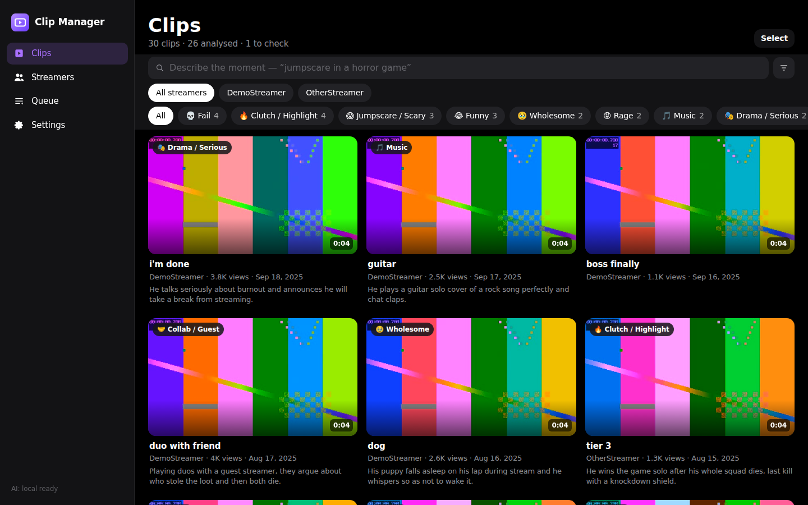
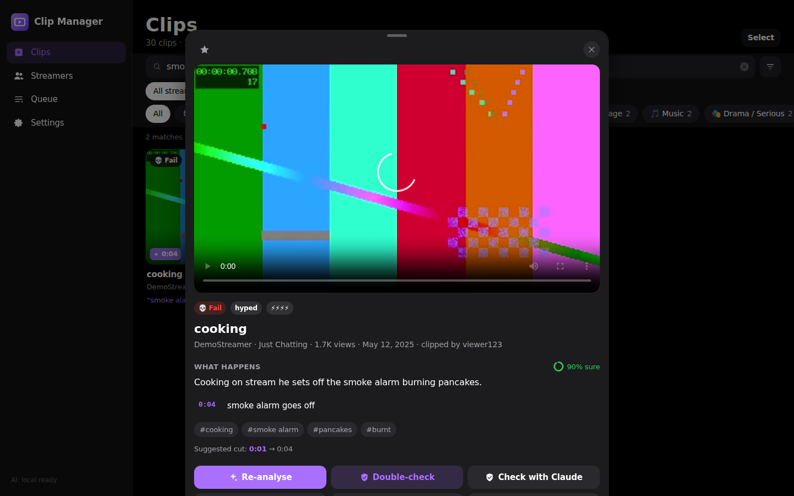
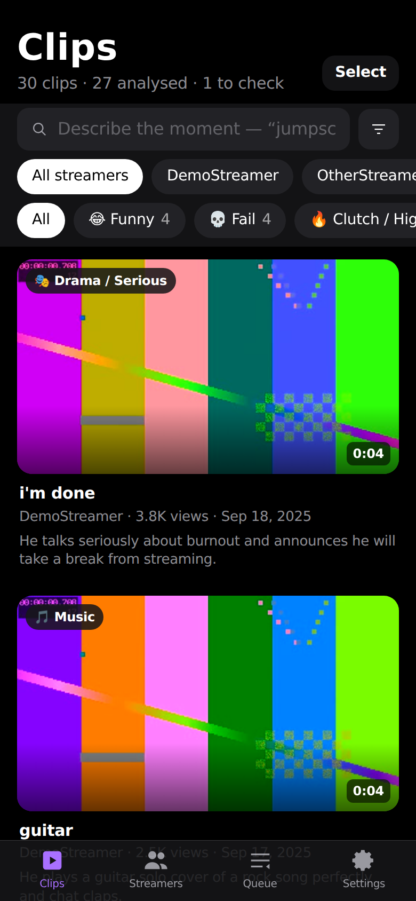
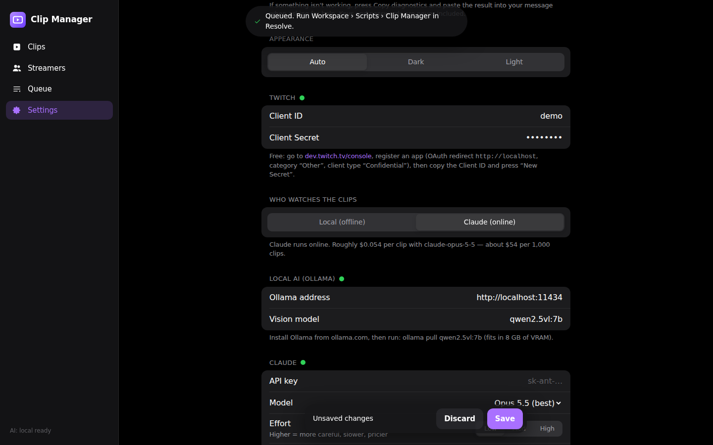

# Twitch Clip Manager

Find the Twitch clip you need by describing what happens in it.

Add any streamer and the app pulls **every** public clip. An AI then *watches* each one: it samples frames, transcribes the speech and writes a description. That gives each clip a category, tags, the key moments with timestamps and a suggested cut. You can search in plain English (“falls off his chair at a jumpscare”), ask questions about a clip, and send picks straight into **DaVinci Resolve Studio**.



| Clip detail | Phone-sized window | Settings |
|---|---|---|
|  |  |  |

## What it does

- **Every clip, not just the top ones.** Twitch's API stops returning results after about 1,000 per query. The app walks back week by week and splits busy weeks until nothing is missed.
- **AI that actually watches.** For each clip it samples about 6 frames and transcribes the audio locally with Whisper. The AI then writes a summary, a category, tags, timestamped moments, mood, energy, whether there's swearing, and a suggested in/out point.
- **It checks its own work.** After describing a clip, the AI picks the 2–4 claims it's least sure of, turns them into yes/no questions, and answers them strictly from the evidence. Tags that don't hold up are removed. Low-confidence clips get a **Check** badge. When the app is idle it re-checks them again.
- **Ask the clip.** A chat box on every clip, e.g. “Does anyone swear?” or “Where would you cut it?”. Answers cite timestamps. **Correct** lets you fix a summary or tags yourself. Your version is final and becomes searchable immediately.
- **Search by meaning.** Keyword search (with a built-in streamer-slang thesaurus) is combined with meaning search from a small local model. Results jump to the matching moment.
- **Offline or online.** *Local* uses a vision model on your graphics card via Ollama: free, private, no internet needed after setup. *Claude* is online and more accurate. You can also keep Local and have Claude **cross-check** only the clips the local AI was unsure about.
- **DaVinci Resolve Studio.** One click imports clips into bins (`Twitch Clips / Streamer / Category`). The summary goes into Comments, tags into Keywords, the title into Description, and each moment becomes a colour-coded marker. Optionally the clip is appended to your timeline, trimmed to the suggested cut.
- **iPhone-style interface.** Dark/light mode, frosted bars, bottom sheets, and hover-to-preview for downloaded clips. Drag a downloaded card straight into Resolve or Explorer.

## Setup (Windows)

There are two files: **`install.bat`** (run once; running it again repairs and updates) and **`ClipManager.bat`** (daily start, also the desktop icon). Both check GitHub for updates, and both open the **Claude chat** this app was built in, next to the app, so you can ask for fixes or changes. Turn that off in **Settings → Open the chat when Clip Manager starts**.

**Install. Pick one of these three ways:**

- **Easiest:** open **PowerShell** (Start menu → type *PowerShell*), paste this line and press Enter:
  ```powershell
  irm https://raw.githubusercontent.com/1mthattwitch/twitchclipmanager/claude/nifty-goodall-p83xy1/install.bat -OutFile $env:TEMP\install.bat; & $env:TEMP\install.bat
  ```
- **Download the file:** right-click **[install.bat](https://raw.githubusercontent.com/1mthattwitch/twitchclipmanager/claude/nifty-goodall-p83xy1/install.bat)** → *Save link as…*. Check that the name ends in `.bat`, not `.txt`, then double-click it. If Windows shows “Windows protected your PC”, click *More info → Run anyway*.
- **ZIP:** on GitHub click **Code → Download ZIP**, unzip it, and double-click `install.bat` inside. Your copy is linked to GitHub so it updates itself.

The installer:
- installs Git and Python if you don't have them, using `winget`, or direct downloads if your PC doesn't have `winget`
- downloads the app to `%USERPROFILE%\twitchclipmanager` and installs its components
- sets up the **offline AI**. It looks for your existing Ollama models first, in `L:\.DoNotTouch\models\.ollama`, then `J:\ai\ollama_models`, then Ollama's usual folder. It uses whichever already has a vision model such as `qwen2.5vl`, so there's nothing to download, and points Ollama at that folder (`OLLAMA_MODELS`). It only downloads the model (about 6 GB, into L:) if no vision model is found. Other files in those drives, like your image-generation models, are never read or changed.
- installs the **DaVinci Resolve** script if Resolve is installed
- puts a **Clip Manager** icon on your desktop and starts the app

**First start:** a setup wizard walks you through:
1. Your free Twitch keys, with step-by-step instructions and a *Test* button.
2. Choosing the AI: your model folders and models, start or restart Ollama, download progress, and an optional Claude key with its own *Test* button.
3. Connecting Resolve.
4. Adding your first streamer.

You can rerun the wizard any time from **Settings → Run the setup wizard**.

**Every day:** double-click the **Clip Manager** desktop icon. It checks GitHub for updates first:

| Situation | What happens |
|---|---|
| A new version is available | It downloads it, then reinstalls components only if the update needs new ones |
| You're offline | It starts the version you already have |
| An update can't be applied (a file in use, or app files edited by hand) | It keeps the working version and tells you. Running `install.bat` again repairs it |

Your settings, clip database, downloaded videos and Ollama models are never touched by updates or repairs.

**If something goes wrong:**
- **Install:** the installer stops, says which step failed, and opens a problem report in Notepad (`ClipManager-problem.txt` on your desktop). Copy it and send it. Every step is also logged in `%LOCALAPPDATA%\ClipManager\install.log`.
- **App:** go to **Settings → Copy diagnostics** and paste the result. Keys and passwords are never included.

macOS/Linux: run `scripts/start.sh`. It does the same update check and installs components when needed.

### Using both graphics cards

Whisper (speech) and the vision model can each have their own GPU. In Settings, set Whisper's **GPU number** to `1`. Then pin Ollama to the first card: quit Ollama from the tray, run `setx CUDA_VISIBLE_DEVICES 0` in a terminal, and start Ollama again. (The launcher clears that variable for the Clip Manager itself, so it still sees both cards.)

### DaVinci Resolve Studio

- **Direct:** in Resolve go to *Preferences → System → General → External scripting using* and choose **Local**. Then use **To Resolve** on a clip, or select several and press **To Resolve**. A project must be open.
- **From inside Resolve:** the installer, or the setup wizard's *Install script* button, adds a **Clip Manager** entry to Resolve's *Workspace → Scripts* menu. Press **Queue for Resolve** in the app, then run that script in Resolve.

**Videos aren't kept.** To sort clips, the app downloads each one only while the AI watches it (a few seconds), then deletes it. The summary, tags, a few still frames and the transcript are kept, which is all search needs. So thousands of clips take up little space. A clip is downloaded again when you send it to Resolve or press **Download** on it; those files live in `library/<streamer>/` (the folder can be changed in Settings). To keep every analysed video, turn on **Settings → Keep videos after analysis**.

### The queue

- Clips are analysed one at a time, most-viewed first. The Queue page shows roughly how long the rest will take. Press **Pause** to stop, and **Resume** to carry on. Waiting clips are always kept.
- **When something is broken** (Ollama not running, Twitch downloads blocked…), 5 clips in a row fail with the same reason and the queue **pauses itself**, instead of failing every waiting clip. A red banner says why, with *Fix it* and *Resume*. The **Why clips failed** list groups failures by reason.
- **Downloads.** The app uses yt-dlp, and if that fails, it downloads the clip directly the way Twitch's own website does. yt-dlp is updated at most once a day on start. A deleted clip just fails on its own and doesn't pause anything.
- **Retry failed** puts failed clips back in the queue and resumes it.

## How accurate is it? Measuring the error rate

Accuracy depends on your model, GPU and streamers, so the app lets you measure it on your own clips. Open PowerShell in the app's `backend` folder and prefix each command with `..\.venv\Scripts\` (e.g. `..\.venv\Scripts\python -m app.evaluate report`):

```
python -m app.evaluate spotcheck --n 25   # you judge 25 random clips: the real error rate, with a 95% range
python -m app.evaluate report             # self-check refutations, flagged clips, your corrections, spot-check result
python -m app.evaluate agreement --n 40   # re-describe 40 clips with the other AI and compare categories/tags
python -m app.evaluate search             # search accuracy with the real meaning-search model
```

Iterating toward zero errors: run `spotcheck`, change one thing, and repeat. Things to try: a bigger local model, Claude, 10 frames per clip, or Claude cross-check. `report` suggests the next step based on your numbers.

## What was tested

`backend/tests` has over 500 automated tests plus a browser end-to-end suite. The Windows installer and launcher are also run in a Windows environment (Wine with Windows Git and Windows Python):

| Area | How | Result |
|---|---|---|
| Twitch ingest | Mock Twitch API that truncates at 1,000 results like the real one; 2,500 clips in one week | All 2,500 found |
| Model output handling | 20,000 randomly malformed AI responses (wrong types, NaN, huge strings, missing fields) | 0 crashes |
| Hostile input | 330 junk/injection search strings; bad API requests | 0 server errors |
| Job runner | 60 clips through the real worker threads with an AI that fails 30% of the time; repeated 15× | Every clip ends done or failed with a reason, never stuck; transient errors retried; all 60 done after “Retry failed” |
| Missing pieces | No speech model, no Resolve, no Ollama, no keys | Clear messages; analysis continues frames-only without Whisper |
| Search (keyword only) | 45 normal + 20 synonym + 20 held-out labelled queries | Normal 100% top-1 · synonyms 90% top-1 / 100% top-5 · held-out 95% top-1 / 100% top-5 |
| UI | Playwright in Chromium: search, filters, clip sheet, ask, correct, analyse, select, Resolve queue, settings, light mode, phone layout; repeated 5× | All pass, zero console errors, no horizontal scroll at 390 px |
| Frame extraction | Real FFmpeg on a generated 12 s video | Frames at the expected timestamps |
| Windows install & updates | 16 scenarios, 46 checks: fresh install from a lone install.bat, updates (including ones that rewrite the running launcher), offline, edited files, repair, ZIP adoption, a failing install, a crash, switching to `main` | All pass; failures produce a problem report naming the step, with the pip error in the log |
| Existing Ollama models | Fake L: and J: drives laid out like the real ones, next to image-generation models, on Windows Python | Finds both stores, uses the one with a vision model, prefers L: when both have it, sets `OLLAMA_MODELS`, skips the 6 GB download, and leaves other folders untouched |
| Clip downloads | Fake Twitch playback API: yt-dlp failing, deleted clip, blocked video server, several qualities | Falls back to Twitch's own playback API, picks the best quality, clear per-clip error for deleted clips, no partial files left |
| Queue under a broken setup | 5 identical failures; mixed failures; deleted clips; pause, resume and retry endpoints; paused banner in the browser | Pauses on the 5th identical failure only, waiting clips stay queued, retry resumes |
| Disk use | Pipeline with the default settings | The video is deleted after analysis; it is downloaded again for Resolve or **Download** |
| Setup wizard | Playwright through every step with fake Twitch, Claude and Ollama | Wrong keys explained, model folder chosen, Ollama restarted, Resolve script installed, settings saved |

Not tested in the development sandbox (it couldn't reach Twitch, Hugging Face or a GPU): live Twitch downloads (both methods are tested against fakes), Whisper/Ollama on CUDA, the meaning-search model, and a live Resolve import. The Resolve code is tested against a faithful fake of Resolve's API. Use the `evaluate` commands above for the real-footage numbers.

Run the tests yourself:

```
cd backend
pip install -r requirements-dev.txt playwright
pytest                 # unit, fuzz, worker, search benchmark
pytest tests/e2e       # browser tests (needs Chromium: python -m playwright install chromium)
```

## Development

- Backend: Python / FastAPI / SQLite (FTS5), `backend/app`. `python -m app` runs it on port 8765.
- Frontend: React + Vite + Tailwind + Motion, `frontend/`. `npm install && npm run dev` gives hot reload on port 5173 (API calls are proxied to 8765). `npm run build` updates `frontend/dist`, which is committed so non-developers don't need Node.
- Settings and the database live in `data/` (git-ignored).
